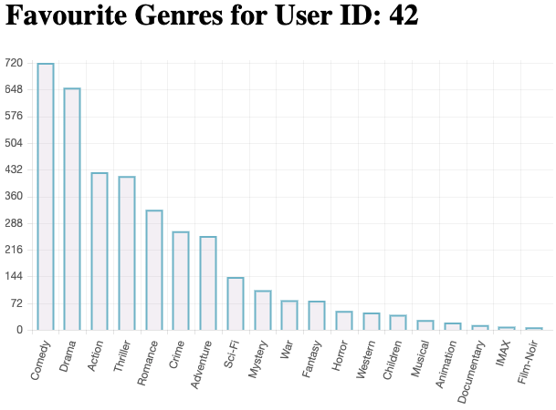

# Apache Spark

The aim was to develop a console-based application in Python and Apache Spark (PySpark) in order to analyse the [MovieLens](https://grouplens.org/datasets/movielens/) dataset, which contains 27,000,000 ratings and 1,100,000 tag applications applied to 58,000 movies by 280,000 users.

The solution enables extensive querying of the dataset. User clustering as well as a recommender engine constitute its more advanced features. Upon starting the console-based application, you will be presented with a self-explanatory menu list. A Flask web app was implemented in addition and can be used to visualise some of the data.



### Compiling and Running Instructions

Navigate into the ```spark``` directory:
```shell script
cd spark
```

Add the  [MovieLens](https://grouplens.org/datasets/movielens/) ```ml-latest``` and ```ml-latest-small``` datasets to the directory. 

Set up a virtual environment within the directory:
```shell script
python -m venv my_env
```

Activate the virtual environment:
```shell script
source my_env/bin/activate
```

Install the requirements to your virtual environment via pip:
```shell script
pip install -r requirements.txt
```

Execute:
```shell script
export FLASK_APP=flask_app.py
```

To run the CLI version:
```shell script
python main_menu.py
```

To run the web app:
```shell script
flask run
```

You will be presented with a URL to open the web app in your browser.

Shared with the kind permission of collaborator ST.